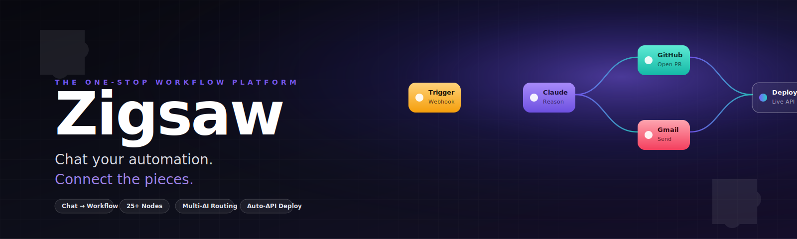

<p align="center">
  
</p>

<p align="center">
  <a href="./CLAUDE.md"></a>
  <a href="./ONE-STOP-WORKFLOW.md"></a>
  
  
  
</p>

---

## What Zigsaw is

**Zigsaw is the one-stop platform that turns plain English into shipped automation.** Type what you want. Watch a workflow appear on the canvas. Run it. Deploy it as a live API. Iterate.

It is the unified product surface that consolidates everything previously split across `zigsaw`, `zigsaw-labs`, `zigsaw-yc`, `zigsaw-mac`, `zigsaw-frontend`, `zigsaw-backend`, and `Zigsaw-lab` — without breaking the UI you already use.

> **Connect the pieces. Chat your automation. Run the loop. Compound the wins.**

---

## Why one repo, four tracks

Zigsaw exposes four on-ramps to the same execution loop. You pick the entry point that matches your problem; the platform handles the rest.

| Track                    | For when you…                                                                 | Drives                                  |
| ------------------------ | ----------------------------------------------------------------------------- | --------------------------------------- |
| **Chat-to-Workflow**     | Know the outcome but not which integrations to wire up.                       | `NaturalLanguageWorkflowCreator`        |
| **Visual Editor**        | Need explicit branching, parallelism, retries, or human approvals.            | ReactFlow canvas + 25+ nodes            |
| **Creative Engine**      | Need to produce, A/B test, and publish short-form video ads at scale.         | Veo 3 + multi-platform publishing       |
| **GitHub Co-pilot**      | Want repo automation: PR review, issue triage, commit audits, security scan. | Mastra + MCP + Claude                   |

All four flow through the **same execution engine, the same observability surface, and the same auto-API deploy** — see [`ONE-STOP-WORKFLOW.md`](./ONE-STOP-WORKFLOW.md).

---

## The 60-second demo

```
User:    "When a GitHub PR opens on lonexreb/zigsaw, summarize it
          with Claude and email me the highlights."

Zigsaw:  → Trigger: GitHub PR Open
         → Claude: Summarize diff
         → Gmail: Send to you
         → Deploy: https://api.figsaw.dev/w/pr-summary

Time:    47 seconds.
Cost:    $0.0021 per run.
```

That's the entire promise. Everything else in this repo exists to make the next run cheaper, faster, smarter, or more powerful.

---

## At a glance

- 🗣️ **Natural-language workflow creation** with multi-provider fallback (Claude → GPT-4 → Groq → templates).
- 🎨 **25+ workflow node types** — AI models, integrations, data, logic, triggers, outputs.
- ⚡ **Real-time streaming execution** — see every node fire, with per-node tokens, latency, and $ cost.
- 🚀 **One-click deploy** — every workflow becomes a live REST endpoint with an auto-published OpenAPI spec.
- 🤖 **First-class AI integration** — Claude, GPT-4, Gemini, Groq, Whisper, BLIP-2, Imagen, Veo3.
- 🔗 **Native integrations** — GitHub, Gmail, Google Calendar, Firecrawl, plus a custom-API connector.
- 🎬 **AI ad creative engine** — generate, test, and publish short-form video ads (TikTok / Reels / Shorts).
- 🐙 **GitHub co-pilot via MCP** — natural-language repo automation as a single composable node.
- 📱 **Mobile-first + WCAG 2.1 AA** — full keyboard, screen-reader, and touch support.
- 🔐 **Enterprise-ready security** — encrypted secrets, OAuth2, Firebase JWT, rate limiting, audit logs.

---

## Repository layout

```
zigsaw/
├── frontend/         Vite + React 18 + TS + ReactFlow + shadcn/ui  ← canonical UI
├── api-backend/      Next.js API routes — chat, firecrawl, workflow execute
├── architecture/     Internal team docs (Northstar, Layered, Diagrams, Refactor)
├── gitbook/          Public docs — published at docs.figsaw.dev
├── assets/           Static assets (banner.svg lives here)
├── CLAUDE.md         Manual for Claude Code & every AI agent
├── ONE-STOP-WORKFLOW.md  End-to-end product workflow + research
└── README.md         You are here
```

For the full layout and per-folder responsibilities, read [`CLAUDE.md`](./CLAUDE.md) §1.

---

## Quickstart (local)

> Prereqs: Node 18+, Bun (or npm), Python 3.12+ if you wire up the optional Python sidecar, a Firebase project, and at least one AI-provider key.

```bash
git clone https://github.com/lonexreb/zigsaw.git
cd zigsaw

# 1. Frontend
cd frontend
bun install          # or: npm install
cp env.example .env  # fill in Firebase + provider keys
bun run dev          # http://localhost:8081

# 2. API backend (separate terminal)
cd ../api-backend
npm install
npm run dev          # Next.js dev server
```

Then open `http://localhost:8081`, sign in, and type your first automation in the chat panel.

### Required environment variables

```bash
# AI providers (set at least one)
ANTHROPIC_API_KEY=…
OPENAI_API_KEY=…
GOOGLE_API_KEY=…
GROQ_API_KEY=…

# Firebase
FIREBASE_API_KEY=…
FIREBASE_AUTH_DOMAIN=…
FIREBASE_PROJECT_ID=…
FIREBASE_SERVICE_ACCOUNT_KEY_PATH=./secrets/firebase.json

# Stripe (optional — only if testing billing)
STRIPE_PUBLISHABLE_KEY=…
STRIPE_SECRET_KEY=…
```

> ⚠️ **Never commit secrets.** If a secret leaks into the repo, rotate it immediately. See [`CLAUDE.md`](./CLAUDE.md) §8.

---

## Tech stack

| Layer        | Choice                                                                                 |
| ------------ | -------------------------------------------------------------------------------------- |
| **Frontend** | React 18 · TypeScript (strict) · Vite · ReactFlow · shadcn/ui · Tailwind · Framer Motion · TanStack Query · dnd-kit · 3d-force-graph |
| **Backend**  | Next.js API routes (TS) · optional Python FastAPI sidecar inherited from `zigsaw-backend` |
| **AI**       | Anthropic Claude · OpenAI · Google Gemini · Groq · Veo 3 · Whisper · BLIP-2 · Imagen   |
| **Data**     | Firebase Firestore · encrypted secrets vault · append-only run log                     |
| **Auth**     | Firebase JWT · OAuth2 for external integrations · SAML/OIDC (enterprise)               |
| **Billing**  | Stripe (`@stripe/react-stripe-js`)                                                     |
| **Tooling**  | Bun · ESLint · Prettier · Jest · Playwright · TypeScript                               |

---

## Architecture (compressed)

```
Browser  →  Edge (Next.js API)  →  Workflow Executor  →  Provider Layer
                  │                       │                    │
                  ▼                       ▼                    ▼
            Auth + Validation     Topo-sorted DAG       Claude / GPT / Veo3
                                  Streaming runtime     GitHub / Gmail / Calendar
                                  Retry + recovery
                                          │
                                          ▼
                                   Firestore + Vault
                                   (state, secrets, runs)
```

Detailed reference architecture lives in [`ONE-STOP-WORKFLOW.md`](./ONE-STOP-WORKFLOW.md) §13 and [`architecture/NORTHSTAR_ARCHITECTURE.md`](./architecture/NORTHSTAR_ARCHITECTURE.md).

---

## Common workflows people ship in week 1

```
GitHub PR opened     →  Claude review     →  Slack post + auto-label
Gmail "invoice"      →  Doc parse         →  Sheet append + reply ack
Webhook (Stripe)     →  Risk score        →  Notion task if flagged
Daily 9am cron       →  Summarize PRs     →  Email digest to team
Image upload         →  BLIP-2 caption    →  Imagen variation + Drive store
Brief + product imgs →  Veo3 ad variants  →  Approval gate → publish
```

Every example above works today on the platform; the chat track will generate any of them in under two seconds.

---

## Documentation

| Where                                     | What you'll find                                    |
| ----------------------------------------- | --------------------------------------------------- |
| [`CLAUDE.md`](./CLAUDE.md)                | Operating manual for Claude Code & every AI agent.  |
| [`ONE-STOP-WORKFLOW.md`](./ONE-STOP-WORKFLOW.md) | End-to-end product workflow, every track, every loop. |
| [`architecture/`](./architecture/)        | Internal team docs (Northstar, Layered, Refactor).  |
| [`gitbook/`](./gitbook/)                  | Public docs — published at docs.figsaw.dev.         |
| [`FIRECRAWL_DEBUG_GUIDE.md`](./FIRECRAWL_DEBUG_GUIDE.md) | Firecrawl integration troubleshooting. |

---

## Pricing tiers

| Tier            | Per month   | Executions | Models                                | Best for                  |
| --------------- | ----------- | ---------- | ------------------------------------- | ------------------------- |
| **Free**        | $0          | 100        | Claude Haiku, GPT-3.5, Groq Llama     | Hobby, prototyping        |
| **7-day Trial** | $0          | 1,000      | Everything                            | Real evaluation           |
| **Pro**         | $29         | 10,000     | + Claude Sonnet, GPT-4, Gemini Pro    | Solo & small teams        |
| **Enterprise**  | Custom      | Unlimited  | + Claude Opus, GPT-4 Turbo + SSO/SLA  | Regulated, on-prem, scale |

Full breakdown in [`ONE-STOP-WORKFLOW.md`](./ONE-STOP-WORKFLOW.md) §11.

---

## Roadmap

- [x] Phase 1 — chat-to-workflow state sync, real Anthropic key plumbing.
- [x] Phase 2 — single-tab UX, inline preview, auto-save, error recovery.
- [x] Phase 3 — mobile responsive, WCAG 2.1 AA, multi-provider fallback.
- [x] Stripe subscriptions + Firebase auth + 25+ workflow nodes.
- [ ] Encrypted API key vault + per-user rate limits.
- [ ] 7-day trial + credit metering.
- [ ] Workflow marketplace (community templates).
- [ ] GitHub Mastra co-pilot surfaced as a Zigsaw node.
- [ ] AI ad creative engine (Veo 3 + multi-platform publishing) merged into the canvas.
- [ ] Enterprise SSO (SAML / OIDC) + immutable audit log.
- [ ] Desktop wrapper (`zigsaw-mac`) once product-market fit is confirmed.

---

## Contributing

Pull requests welcome. Read [`CLAUDE.md`](./CLAUDE.md) first — it spells out conventions, security rules, and the agent delegation map.

Quick checklist before opening a PR:

- `bun run lint` clean
- `bun run build` clean
- `bun run test:all` green
- New nodes documented in `gitbook/features/`
- No secrets in the diff

For non-trivial changes, run the `code-reviewer` agent before requesting human review.

---

## Why "Zigsaw"

Like a jigsaw puzzle, Zigsaw helps you connect the pieces — AI models, APIs, services, integrations — into one coherent picture: your perfect automated workflow. Unlike traditional automation tools, Zigsaw speaks your language. Describe what you need; watch your words become production-ready automation.

**The future of automation is conversational. The future is Zigsaw.**

---

<p align="center">
  <sub>
    Built with care for the automation community ·
    <a href="https://figsaw.dev">Website</a> ·
    <a href="https://docs.figsaw.dev">Docs</a> ·
    <a href="https://github.com/lonexreb/zigsaw/issues">Issues</a>
  </sub>
</p>
