# AgentOps Flow Forge - Architecture Diagrams

## System Architecture Diagrams

### 1. High-Level System Architecture

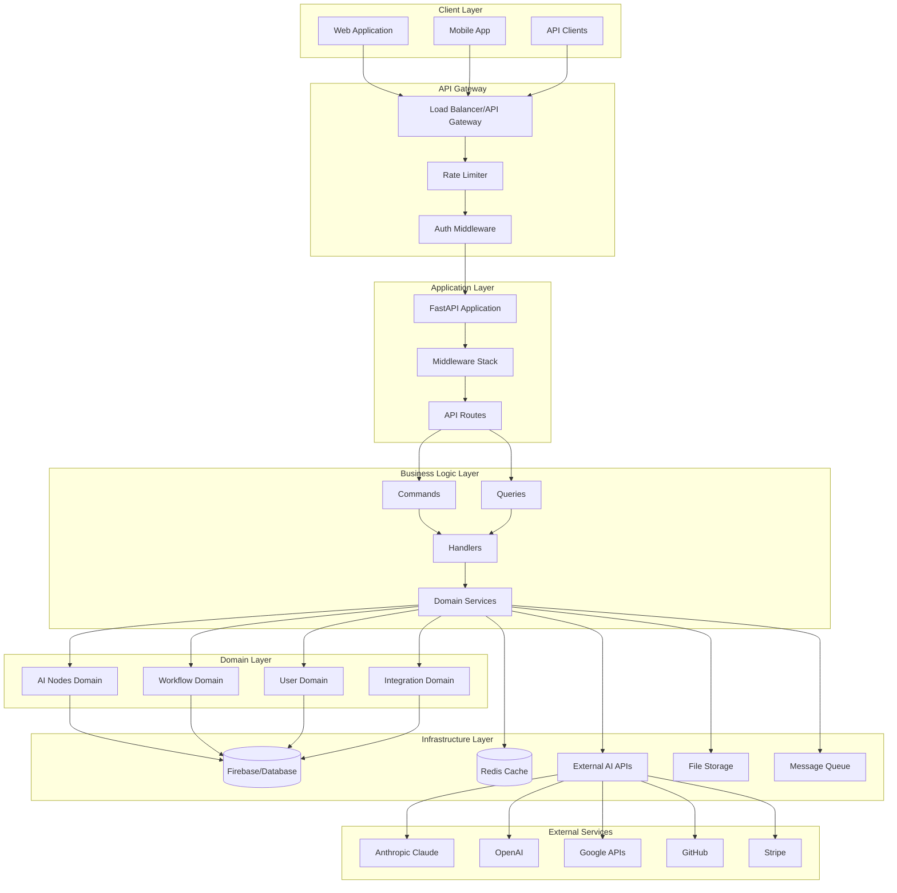

### 2. Layered Architecture Detailed View

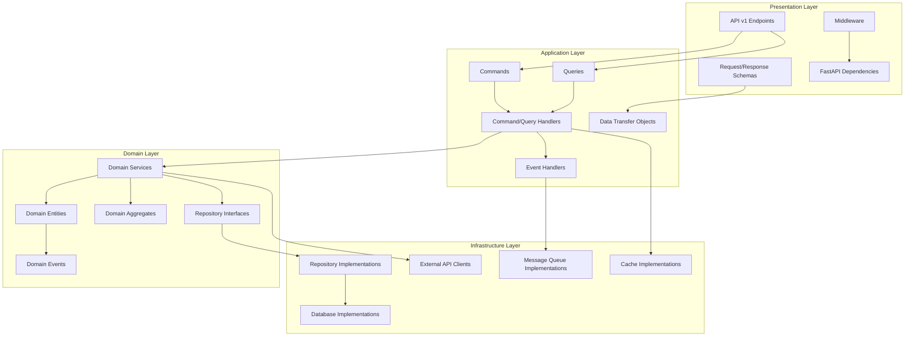

### 3. Domain-Driven Design Structure

```mermaid
graph TB
    subgraph "Core Domain"
        INTERFACES[Core Interfaces]
        ENTITIES_C[Base Entities]
        EXCEPTIONS[Custom Exceptions]
        SECURITY[Security Components]
        VALIDATION[Validation Framework]
    end
    
    subgraph "AI Nodes Domain"
        AI_ENTITIES[AI Node Entities]
        AI_SERVICES[AI Node Services]
        AI_REPOSITORIES[AI Node Repositories]
        AI_COMMANDS[AI Node Commands]
        AI_EVENTS[AI Node Events]
    end
    
    subgraph "Workflow Domain"
        WF_ENTITIES[Workflow Entities]
        WF_SERVICES[Workflow Services]
        WF_REPOSITORIES[Workflow Repositories]
        WF_COMMANDS[Workflow Commands]
        WF_EVENTS[Workflow Events]
        EXECUTION_ENGINE[Execution Engine]
    end
    
    subgraph "User Domain"
        USER_ENTITIES[User Entities]
        USER_SERVICES[User Services]
        USER_REPOSITORIES[User Repositories]
        USER_COMMANDS[User Commands]
        SUBSCRIPTION[Subscription Service]
    end
    
    subgraph "Integration Domain"
        PROVIDERS[AI Providers]
        EXTERNAL_SERVICES[External Services]
        PROVIDER_REGISTRY[Provider Registry]
        CLIENT_FACTORIES[Client Factories]
    end
    
    AI_ENTITIES --> INTERFACES
    AI_SERVICES --> INTERFACES
    AI_REPOSITORIES --> INTERFACES
    
    WF_ENTITIES --> INTERFACES
    WF_SERVICES --> INTERFACES
    WF_REPOSITORIES --> INTERFACES
    EXECUTION_ENGINE --> AI_SERVICES
    
    USER_ENTITIES --> INTERFACES
    USER_SERVICES --> INTERFACES
    USER_REPOSITORIES --> INTERFACES
    
    PROVIDERS --> INTERFACES
    EXTERNAL_SERVICES --> INTERFACES
    PROVIDER_REGISTRY --> PROVIDERS
    
    WF_SERVICES --> AI_SERVICES
    WF_SERVICES --> INTEGRATION_DOMAIN
    AI_SERVICES --> INTEGRATION_DOMAIN
```

## Workflow Execution Diagrams

### 4. Workflow Execution Sequence Diagram

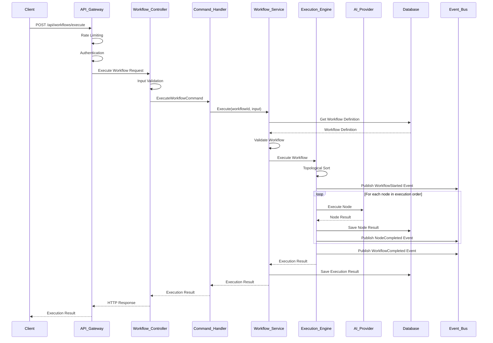

### 5. AI Node Execution Flow

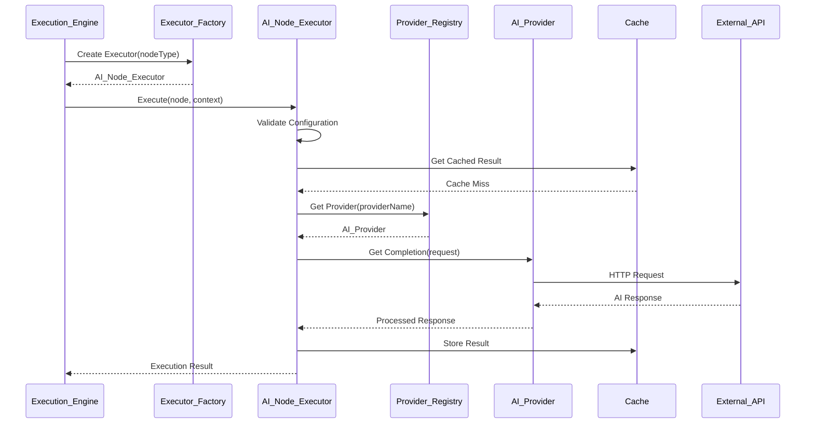

### 6. Authentication & Authorization Flow

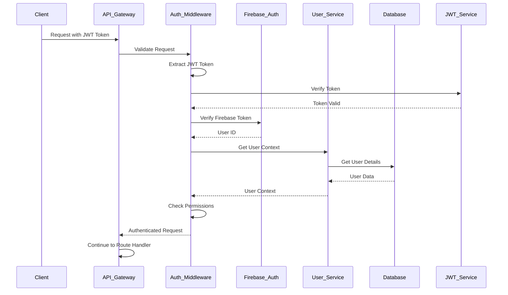

### 7. Caching Strategy Flow

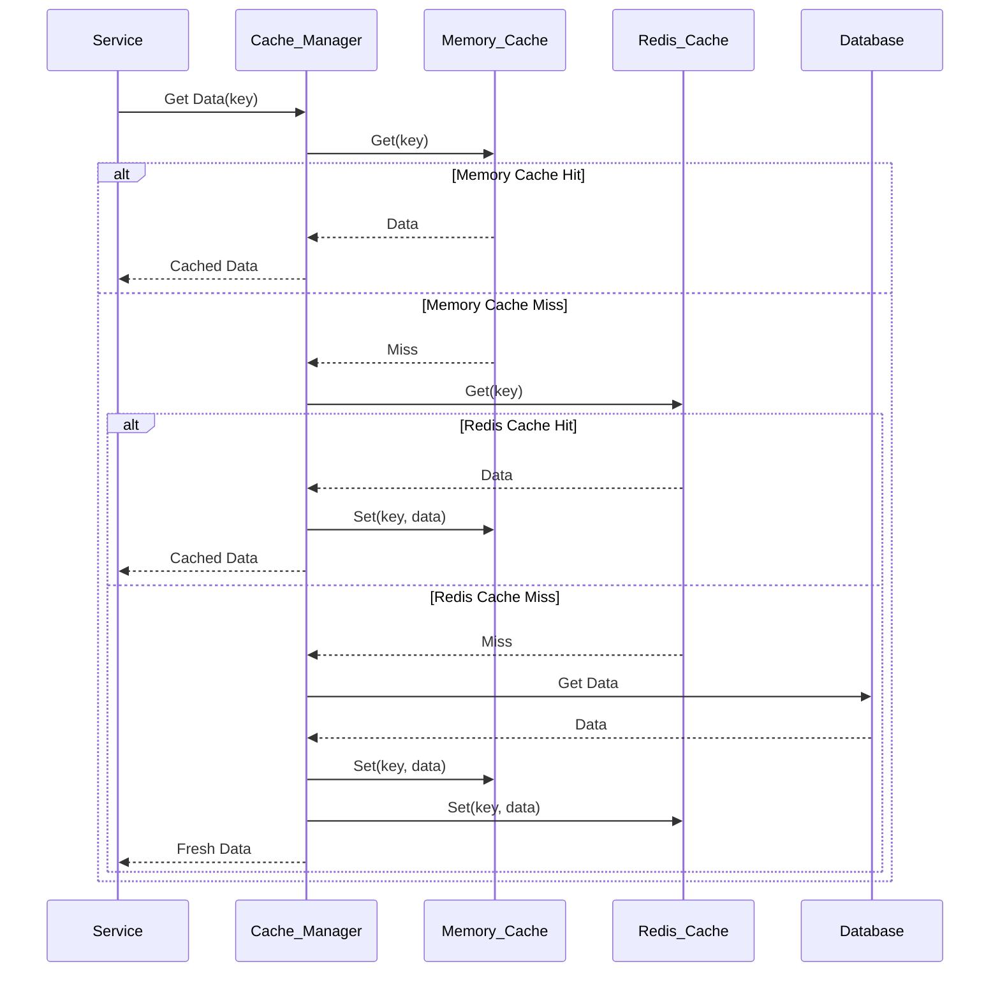

## Security Architecture Diagrams

### 8. Security Architecture Overview

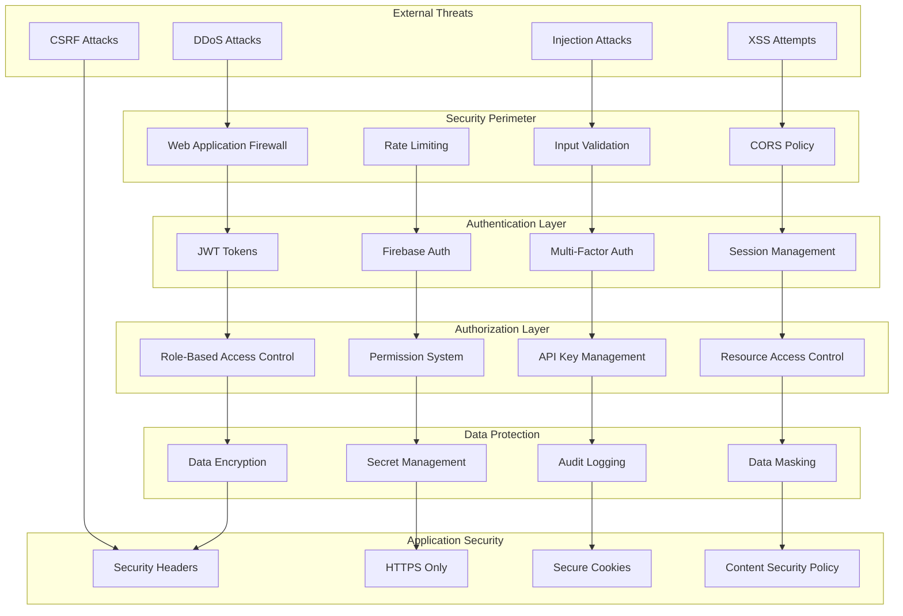

### 9. Secret Management Architecture

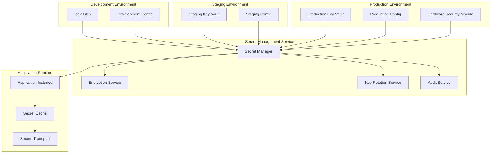

## Performance Architecture Diagrams

### 10. Performance Optimization Architecture

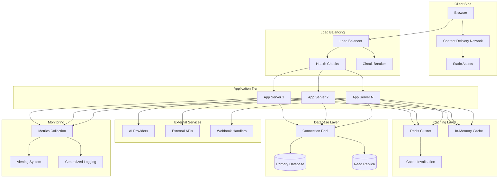

### 11. Event-Driven Architecture

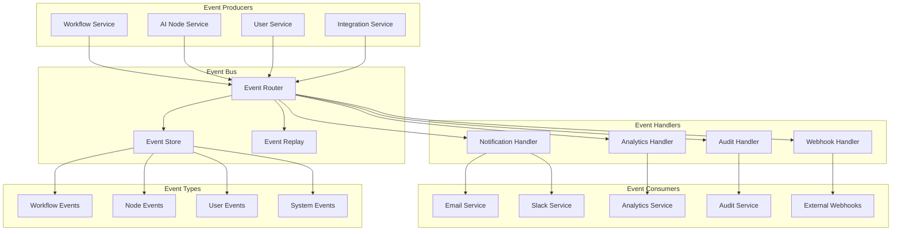

## Deployment Architecture

### 12. Deployment Architecture

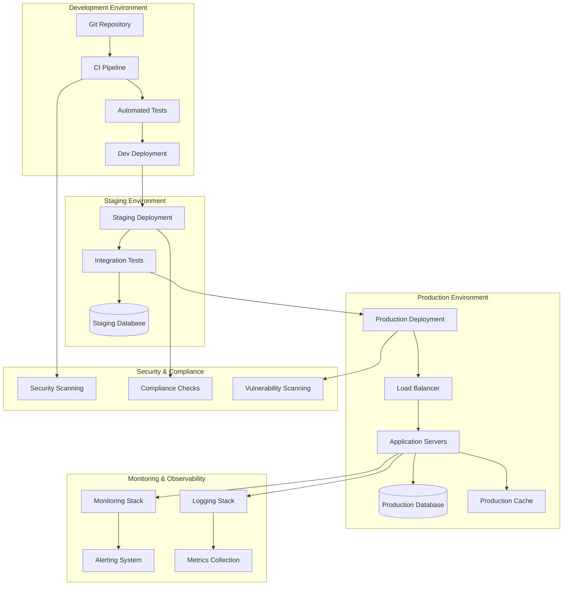

These diagrams provide a comprehensive view of the refactored architecture, showing how different components interact and the flow of data and control through the system. The diagrams cover all major aspects including system architecture, security, performance, and deployment strategies.