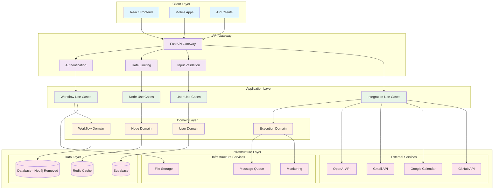
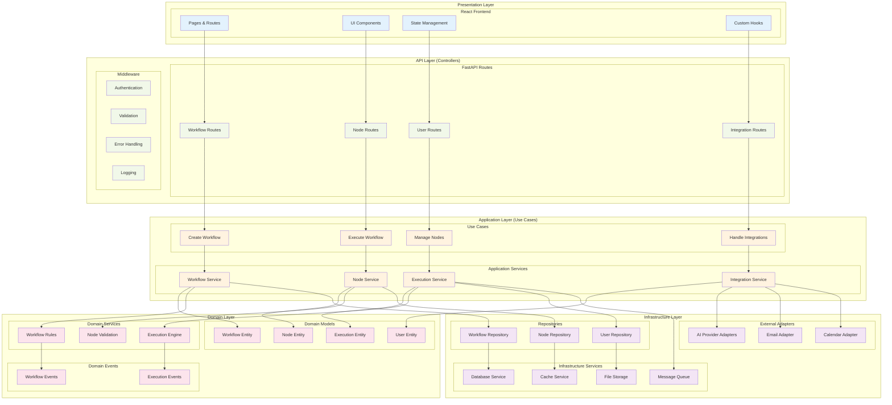
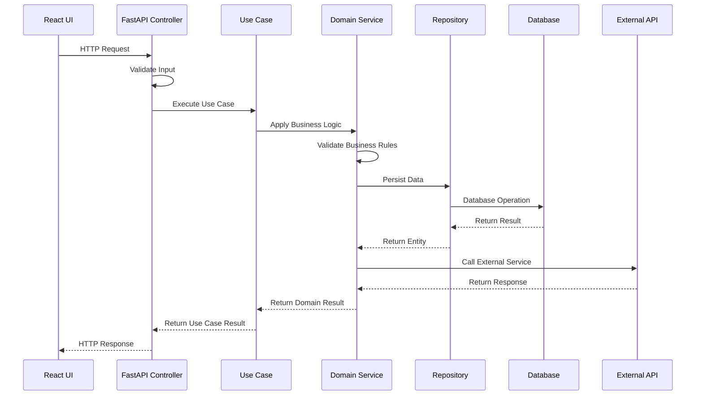
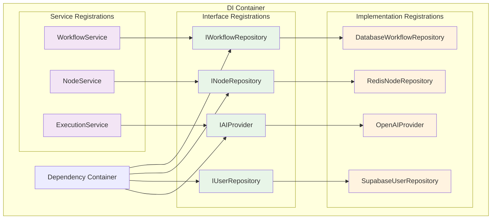
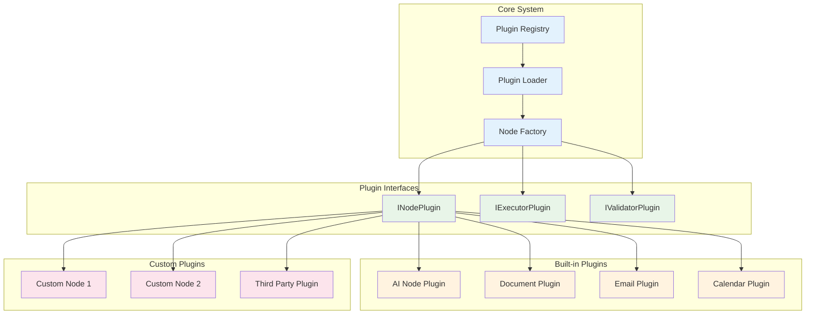
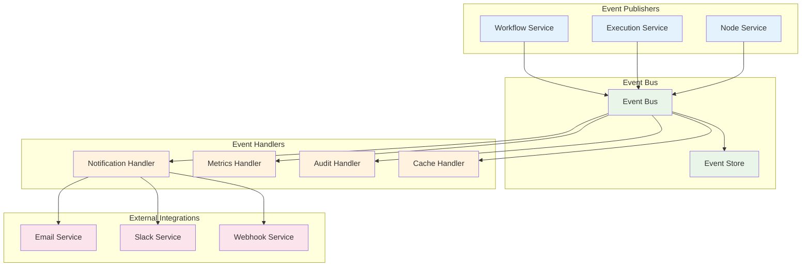

# Architecture Diagram

## System Architecture Overview

## Layered Architecture Detail

## Component Interaction Flow

## Dependency Injection Container

## Plugin Architecture

## Event-Driven Architecture

This architecture provides:
- **Clear separation of concerns** across layers
- **Dependency inversion** with interfaces
- **Plugin-based extensibility** for new node types
- **Event-driven communication** for loose coupling
- **Proper dependency injection** for testability
- **Scalable infrastructure** for growth