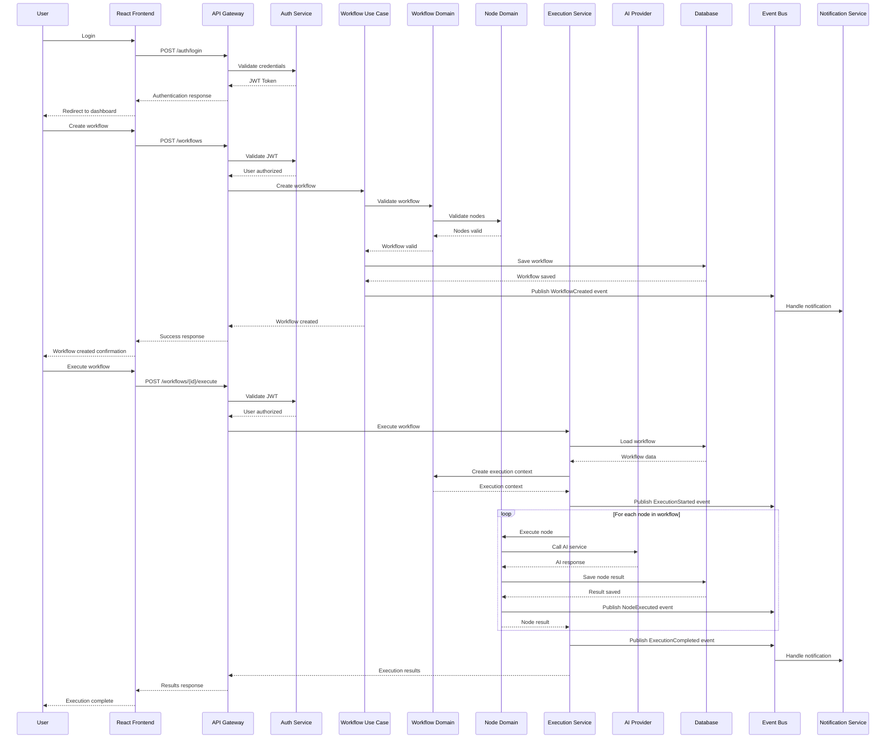
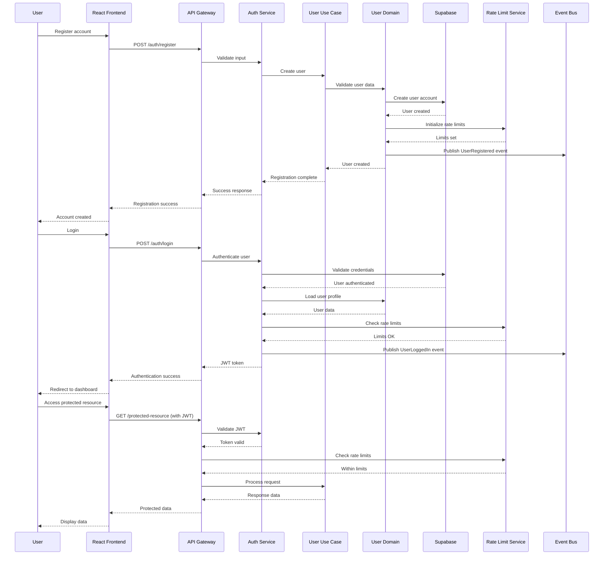
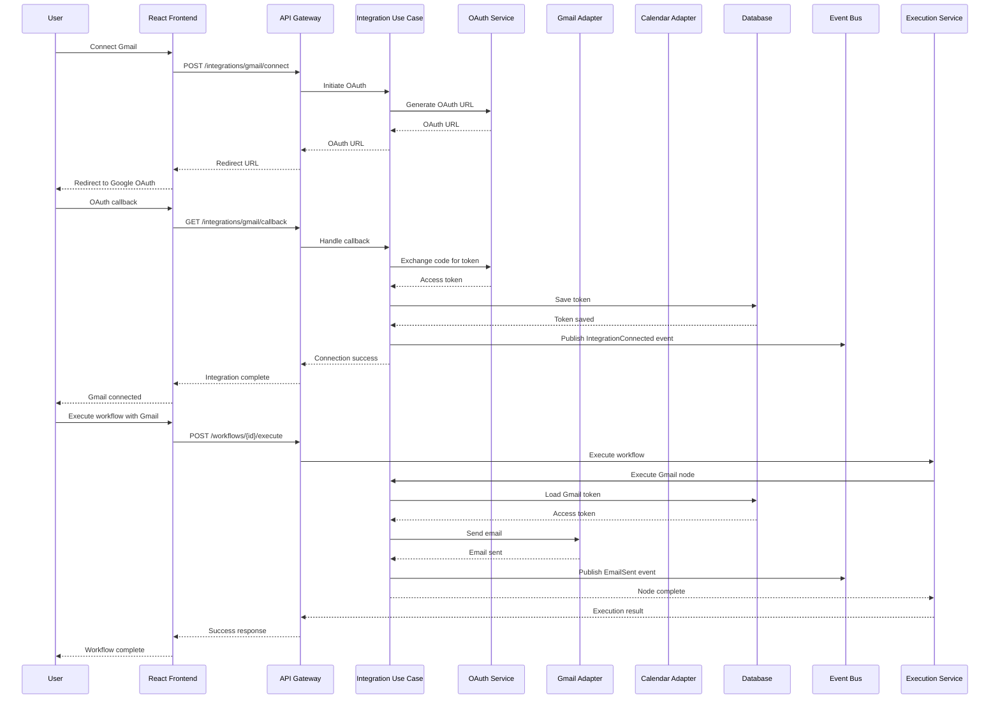
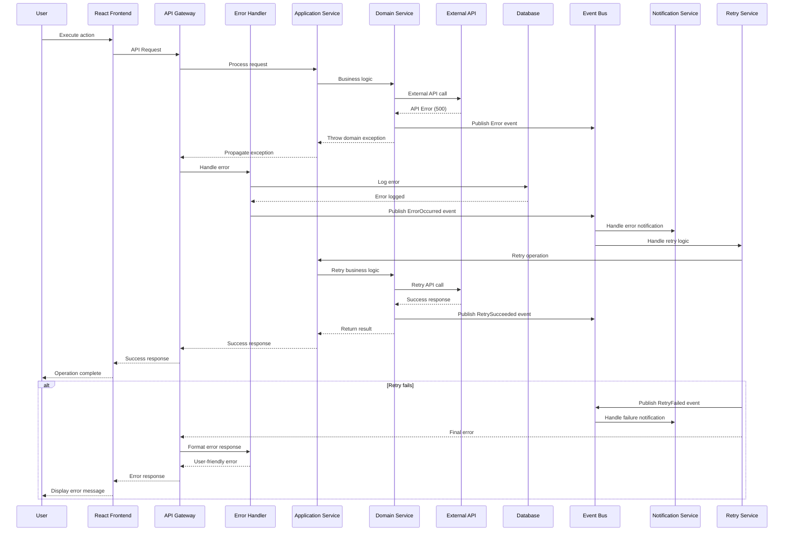
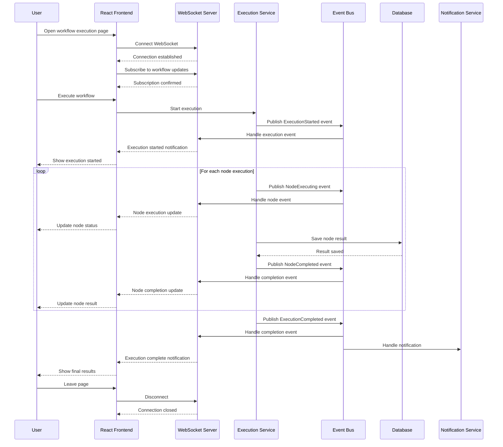
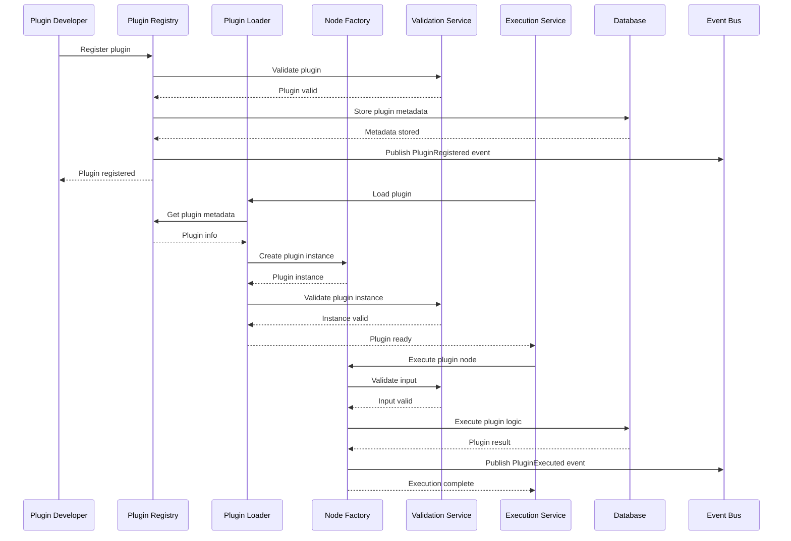

# Sequence Diagrams

## 1. Workflow Creation and Execution Flow



## 2. Node Configuration and Testing Flow

```mermaid
sequenceDiagram
    participant User as User
    participant UI as React Frontend
    participant Gateway as API Gateway
    participant NodeUC as Node Use Case
    parameter NodeDomain as Node Domain
    participant ConfigService as Config Service
    participant ValidationService as Validation Service
    participant AIProvider as AI Provider
    participant Database as Database
    participant EventBus as Event Bus
    
    %% Node Configuration
    User->>UI: Configure AI node
    UI->>Gateway: POST /nodes/{id}/config
    Gateway->>NodeUC: Configure node
    NodeUC->>NodeDomain: Validate configuration
    NodeDomain->>ValidationService: Validate AI settings
    ValidationService-->>NodeDomain: Validation result
    NodeDomain->>ConfigService: Save configuration
    ConfigService->>Database: Persist config
    Database-->>ConfigService: Config saved
    ConfigService-->>NodeDomain: Configuration stored
    NodeDomain->>EventBus: Publish NodeConfigured event
    NodeDomain-->>NodeUC: Configuration complete
    NodeUC-->>Gateway: Success response
    Gateway-->>UI: Config saved
    UI-->>User: Configuration saved
    
    %% Node Testing
    User->>UI: Test node configuration
    UI->>Gateway: POST /nodes/{id}/test
    Gateway->>NodeUC: Test node
    NodeUC->>NodeDomain: Create test context
    NodeDomain->>ConfigService: Load configuration
    ConfigService-->>NodeDomain: Node config
    NodeDomain->>AIProvider: Test API call
    AIProvider-->>NodeDomain: Test response
    NodeDomain->>EventBus: Publish NodeTested event
    NodeDomain-->>NodeUC: Test results
    NodeUC-->>Gateway: Test response
    Gateway-->>UI: Test results
    UI-->>User: Test complete
```

## 3. User Authentication and Authorization Flow



## 4. Integration Service Flow (Gmail/Calendar)



## 5. Error Handling and Recovery Flow



## 6. Real-time Updates and WebSocket Flow



## 7. Plugin System Flow



These sequence diagrams show the complete flow of operations across the layered architecture, demonstrating:

1. **Proper separation of concerns** across layers
2. **Event-driven communication** for loose coupling
3. **Error handling and recovery** mechanisms
4. **Real-time updates** for better user experience
5. **Plugin extensibility** for custom functionality
6. **Security and authorization** throughout the system
7. **Integration patterns** for external services

The diagrams illustrate how the refactored architecture maintains clean boundaries while enabling complex workflows and integrations.