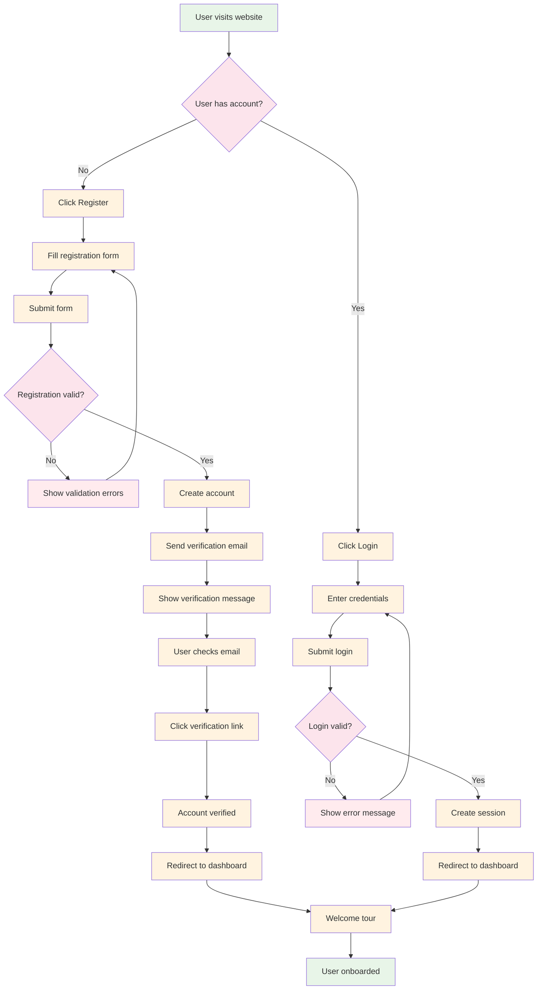
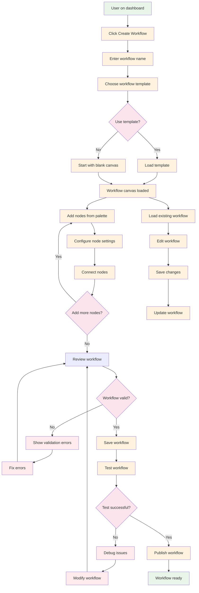
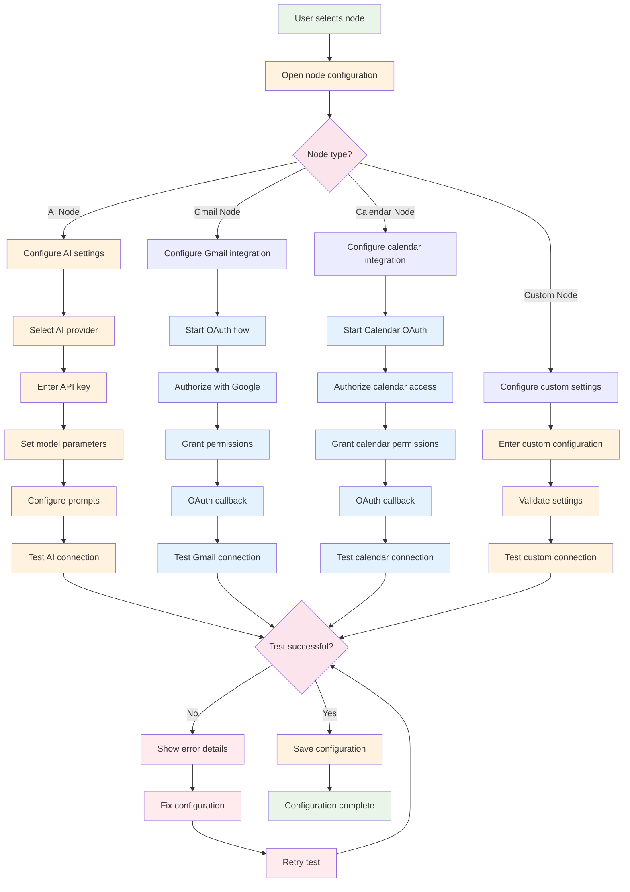
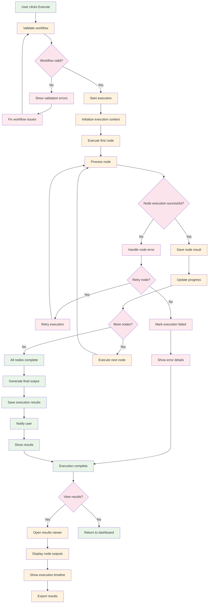
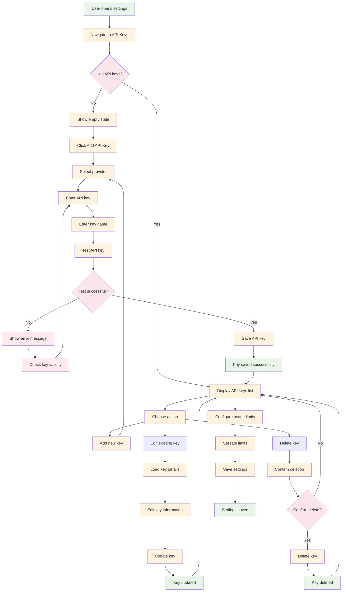
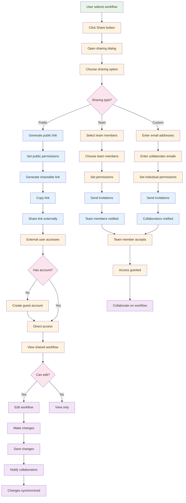
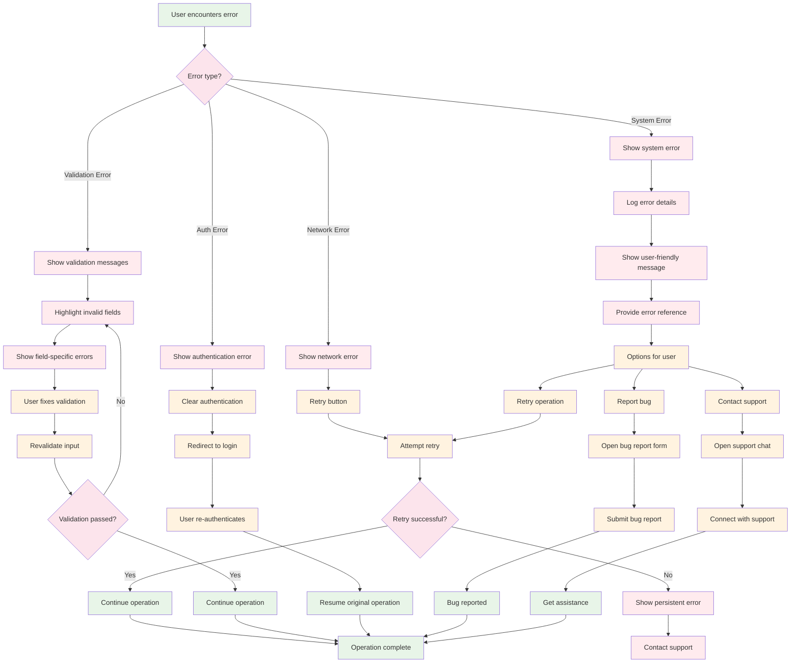
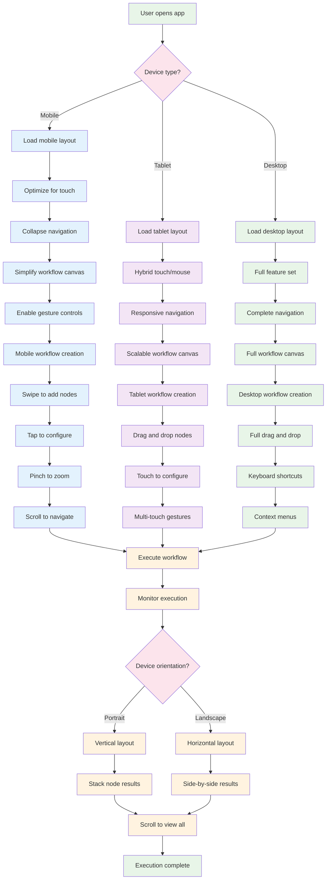

# User Flow Diagrams

## 1. User Onboarding and Registration Flow

## 2. Workflow Creation and Management Flow

## 3. Node Configuration and Integration Flow

## 4. Workflow Execution and Monitoring Flow

## 5. API Key and Settings Management Flow

## 6. Collaboration and Sharing Flow

## 7. Error Handling and Recovery Flow

## 8. Mobile and Responsive Experience Flow

These user flow diagrams demonstrate:

1. **Complete user journeys** from start to finish
2. **Error handling and recovery** at each step
3. **Multi-device experience** considerations
4. **Collaboration and sharing** workflows
5. **Integration setup** processes
6. **Settings management** flows
7. **Real-time execution** monitoring
8. **Responsive design** considerations

The flows show how users interact with the system across different scenarios and devices, ensuring a smooth and intuitive experience throughout their journey.